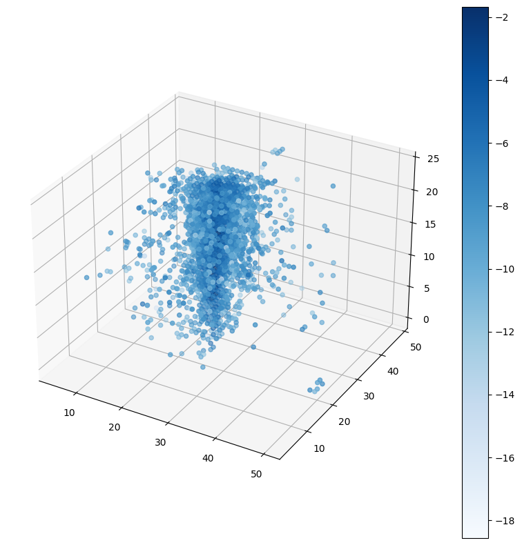
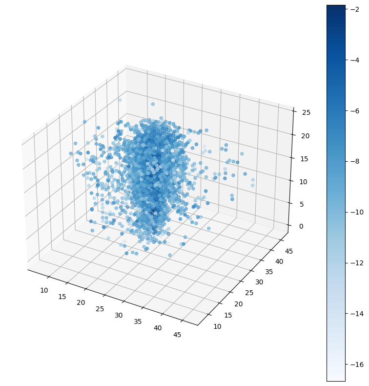
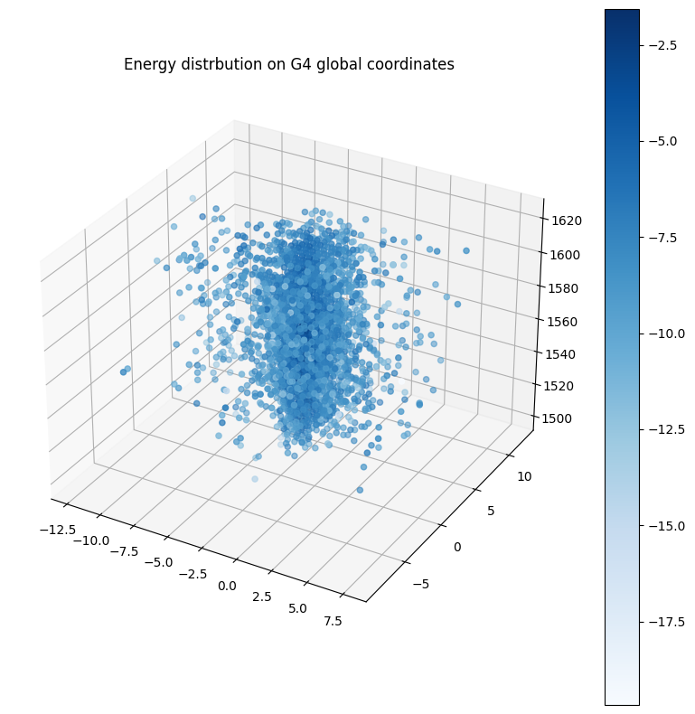

<style>
.new {
  color: black;
  font-weight: 700;
  font-size: 30px;
}
</style>

# Integration of 3D-GAN Model into GEANT4

## Name: Alexandru-Mihai Hau

### Credits

This project represent a part of the research activity conducted by the Geant4 group at CERN (European Council of Nuclear Research - Geneva, Switzerland). The original template from which the project has been inspired can be found [here]:  

### Instructions for running the code

The best way to run the code is from the terminal - clone the overall repository and in the same directory with the repo, create an empty directory for the build. Type the following for creating and switching to the build directory:

```
mkdir Par04_build
cd Par04_build
```
Now you are in the build directory. In order to proceed with the project, one needs to source the executables required for GEANT4 and ROOT. For this project, the version G4.11 (the source will not work for G4.10.07 for instance). It is best if this project is run on lxplus cluster within CERN.

The project makes heavy use of the ONNX Runtime Deep Learning framework. In order to use it in the project, run the following command:

```
source /cvmfs/sft.cern.ch/lcg/views/LCG_100/x86_64-centos7-gcc10-opt/setup.sh
```

Afterwards, the Geant4-11.0 version needs to be run:
```
source /cvmfs/geant4.cern.ch/geant4/11.0/x86_64-centos7-gcc10-optdeb/CMake-setup.sh
```
The C++ compiler needs to be sourced as well:

```
source /cvmfs/sft.cern.ch/lcg/contrib/gcc/10.3.0/x86_64-centos7-gcc10-opt/setup.sh
```

Finally, now the cmake command can be implemented in order to actually run the build for the project:

```
cmake -DGeant4_DIR=/cvmfs/geant4.cern.ch/geant4/11.0/x86_64-centos7-gcc10-optdeb/lib64/Geant4-11.0 $HOME/Par04
make
```

##### Note: 

Move the following .mac files from the Par04 folder to the Par04_build: 
```
my_new_vis.mac
my_onnx_sims.mac
my_full_sims.mac
my_full_vis.mac
```

Also move the following .C file from the Par04 directory to the build, as well as the constructed .gdml file for the detector:
```
AnalyseEnergyBox.C
NewCLIC.gdml
```

##### Detector visualization on G4

The build is now properly run. For visualizing the detector only, run the following command:
```
./examplePar04 -i -m my_new_vis.mac
```

##### ONNX Runtime G4 Simulations

For running the Fast Simulations on G4, run the following inside the build:
```
./examplePar04 -m my_onnx_sims.mac
```

The data generated from the integrated 3D-GAN network in G4 is stored in the following file: ONNXInference.root. A .C file has been designed for further analysis on ROOT. However, the plots have been much clearer on Python Jupyter Notebooks, hence the .C file has only been designed to store the data in .txt format for the next load into the jupyter notebook. However, the .C can be further modified for ROOT visualizations. For this program to run until the finish, do in the same build directory the following:

```
root AnalyseEnergyBox.C
```

Afterwards, open the Jupyter Notebook from the Par04 repository and run it. The plots below will be found on the Jupyter Notebook as well (the jupyter notebook can be run separately - best case scenario, scp it on the local machine and run it there):







[here]: https://gitlab.cern.ch/geant4/geant4/-/tree/master/examples/extended/parameterisations/Par04
